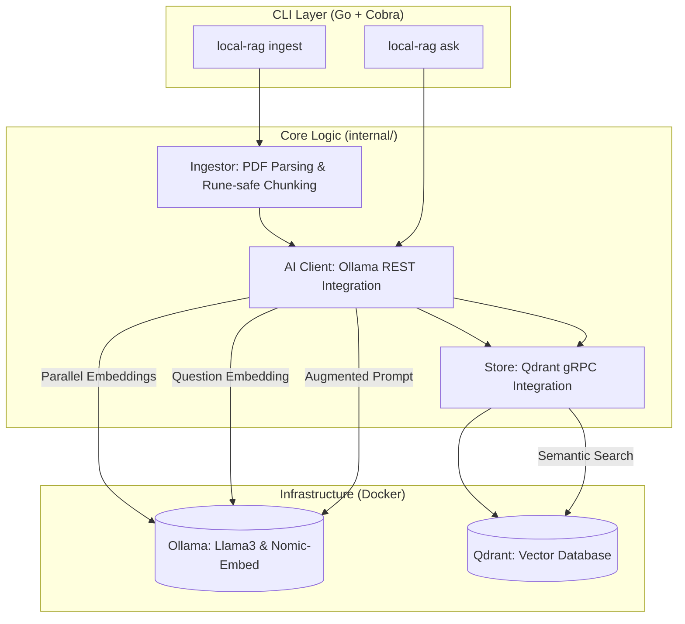

# 📚 local-rag: Your Private Software Architecture Librarian

`local-rag` is a high-performance, Go-based CLI tool that allows you to have a conversation with your personal library of software architecture books. 

By using **Retrieval-Augmented Generation (RAG)**, the application provides context-aware answers derived strictly from your local PDFs. No data ever leaves your machine—all inference and storage happen locally via Ollama and Qdrant.

---

## 🏗️ System Architecture



---

## 🚀 Key Features

- **Concurrent Ingestion**: Utilizes a Go **Worker Pool** (Goroutines + Channels) to generate embeddings 4x faster than sequential processing.
- **Rune-Safe Chunking**: Custom sliding-window chunker that respects Unicode character boundaries to prevent token corruption.
- **Efficient Retrieval**: Uses **Qdrant** for high-performance vector similarity search via gRPC.
- **Local-First Privacy**: Powered by **Ollama**, ensuring your private documents are never sent to a cloud provider.
- **Metadata Preservation**: Tracks page numbers and file paths for future citation support.

---

## 🛠️ Tech Stack

| Component | Technology |
| :--- | :--- |
| **Language** | Go (1.25+) |
| **CLI Framework** | Cobra |
| **LLM Inference** | Ollama (`llama3`) |
| **Embedding Model** | `nomic-embed-text` |
| **Vector DB** | Qdrant (gRPC) |
| **PDF Parsing** | `ledongthuc/pdf` |

---

## 📦 Installation & Setup

### 1. Prerequisites
- [Go](https://go.dev/dl/) 1.25+
- [Docker](https://www.docker.com/) & Docker Compose
- [Ollama](https://ollama.com/)

### 2. Start Infrastructure
```bash
docker-compose up -d
```

### 3. Prepare Models
```bash
docker exec -it ollama ollama pull llama3
docker exec -it ollama ollama pull nomic-embed-text
```

---

## ⌨️ Usage

### Ingest Documents
Process a directory of PDFs and store them in a specific collection:
```bash
go run main.go ingest --path ./my_books --topic software-architecture
```

### Ask Questions
Retrieve context and generate an answer based on your library:
```bash
go run main.go ask --topic software-architecture "What are the trade-offs of microservices?"
```

---

## 🗺️ Roadmap
- [ ] **Source Citations**: Include file names and page numbers in the generated response.
- [ ] **Loading Feedback**: Add a concurrent CLI spinner for better UX during long generations.
- [ ] **Interactive Mode**: A persistent chat session for follow-up questions.
- [ ] **EPUB Support**: Expand beyond PDFs to support the full library.

---

## 📄 License
MIT
