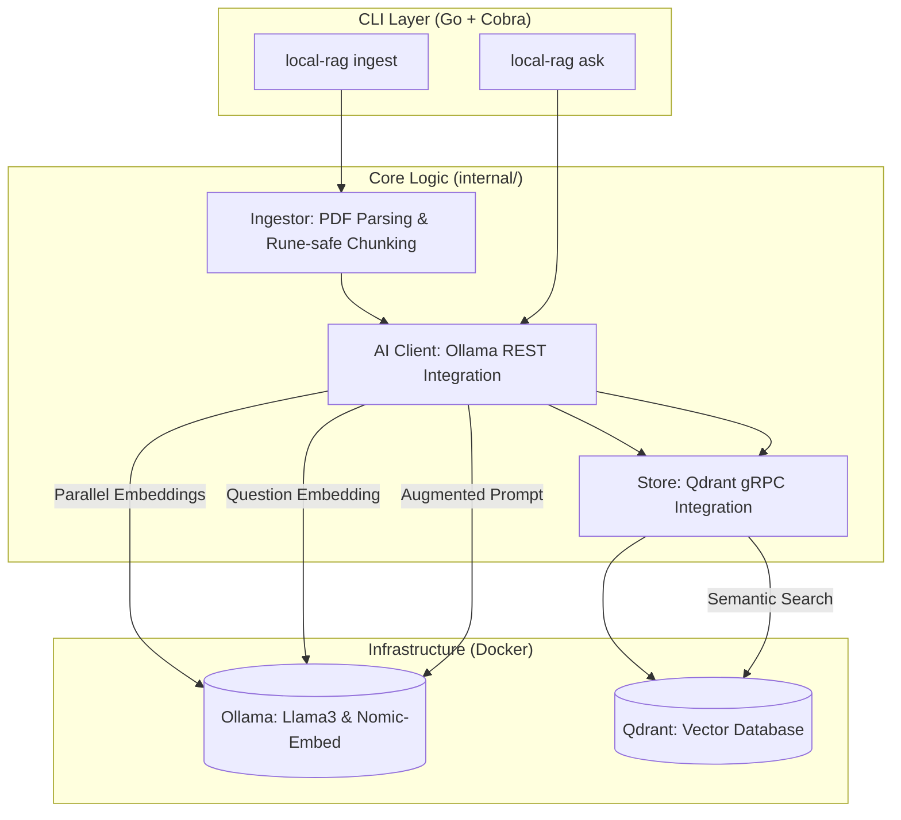

# Local RAG: Software Architecture Library

A high-performance, Go-based CLI application for "talking" to your personal collection of software architecture books. This project uses **Retrieval-Augmented Generation (RAG)** to provide context-aware answers based on your private library.

This is a personal project to try out embedding pipelines and to learn Golang.

## 🏗️ System Architecture



## 🚀 Key Features

- **Concurrent Ingestion**: Uses a Go **Worker Pool** (Goroutines + Channels) to generate embeddings 4x faster than sequential processing.
- **Rune-Safe Chunking**: Custom sliding-window chunker that respects Unicode character boundaries.
- **Metadata-Rich Storage**: Preserves page numbers, file paths, and sequence indices for precise citations.
- **Local-First**: All data stays on your machine using Ollama and Qdrant.

## 🛠️ Tech Stack

| Component | Technology |
| :--- | :--- |
| **Language** | Go (1.25+) |
| **CLI Framework** | Cobra |
| **LLM Inference** | Ollama |
| **Embedding Model** | `nomic-embed-text` |
| **Vector DB** | Qdrant (gRPC) |
| **PDF Parsing** | `ledongthuc/pdf` |

## 📦 Setup & Usage

### 1. Start Infrastructure
```bash
docker-compose up -d
```

### 2. Prepare Models (inside container)
```bash
docker exec -it ollama ollama pull llama3
docker exec -it ollama ollama pull nomic-embed-text
```

### 3. Ingest Books
```bash
go run main.go ingest --path ./my_books --topic software-architecture
```

### 4. Ask Questions (Coming Soon!)
```bash
go run main.go ask --topic software-architecture "What are the trade-offs of microservices?"
```
